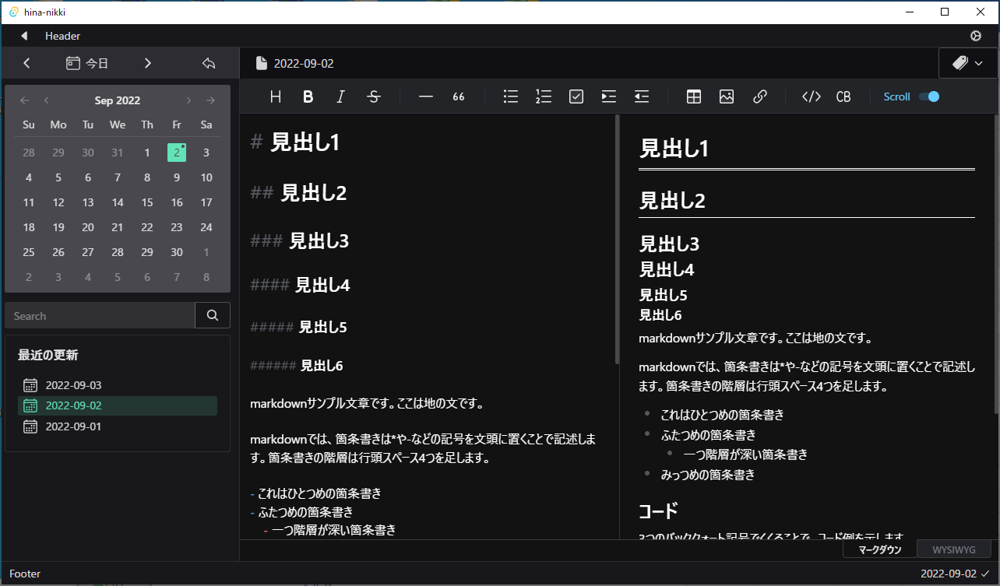

# ひなにっき（Hina Nikki）

This project is a markdown notepad using tauri.  
Currently, only Japanese is supported.  

Markdownをベースとした日記帳＆メモ帳です。  




## 構成

Tauri + Nuxt3 + TS + SCSS + WindiCSS + SQLite  

- back
  - [tauri\-apps/tauri](https://github.com/tauri-apps/tauri) : Desktop アプリフレームワーク
  - [SQLite](https://www.sqlite.org/index.html) : ファイルDB
  - [mbs\-code/tauri\-plugin\-sql](https://github.com/mbs-code/tauri-plugin-sql) : sqlx ラッパー
    - [tauri\-apps/tauri\-plugin\-sql](https://github.com/tauri-apps/tauri-plugin-sql) の独自フォーク
- front
  - [nuxt/framework](https://github.com/nuxt/framework) : Vue フレームワーク
  - [vueuse/vueuse](https://github.com/vueuse/vueuse) : Vue utility ライブラリ
  - [date\-fns/date\-fns](https://github.com/date-fns/date-fns) : 日付ライブラリ
  - [koskimas/kysely](https://github.com/koskimas/kysely) : SQLビルダー
  - [nhn/tui\.editor](https://github.com/nhn/tui.editor) : Markdownエディター
- design
  - [windicss/windicss](https://github.com/windicss/windicss) : Tailwind 互換 CSS ライブラリ
  - [tusen\-ai/naive\-ui](https://github.com/tusen-ai/naive-ui) : Vue UI ライブラリ
  - [07akioni/xicons: ionicons5)](https://github.com/07akioni/xicons) : アイコンライブラリ


## howto

```bash
# at first
$ yarn install

# develop
$ yarn tauri dev

# analyze bundle file
$ yarn nuxt analyze

# build app
$ yarn tauri build
```
